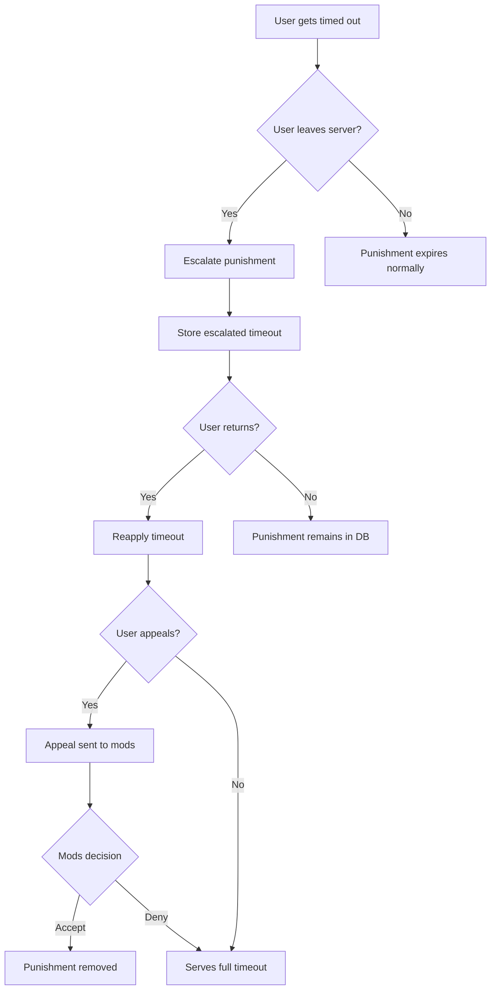

# EvadeGuard Discord Bot

<div align="center">


[](https://github.com/sandkri/EvadeGuard/stargazers)
[](https://github.com/sandkri/EvadeGuard/commits)
[](https://github.com/sandkri/EvadeGuard/commits)
[](https://github.com/sandkri/EvadeGuard)
[](LICENSE)
[](https://discord.js.org)

**🛡️ Smart moderation for Discord servers that prevents timeout evasion**

</div>

## ✨ Overview

EvadeGuard is a specialized moderation bot that solves a common Discord server problem: users leaving servers to escape timeouts. By tracking and escalating punishments when users attempt to circumvent moderation actions, EvadeGuard ensures fair rule enforcement across your community.

<details open>
<summary><b>🌟 Key Features</b></summary>

- 🔒 **Smart Timeout Tracking**: Automatically detects when users leave during active timeouts
- ⚖️ **Progressive Punishment**: Escalates timeout durations for users who attempt to evade
- 🔄 **Automatic Re-application**: When timeout evaders return, their punishment is immediately reinstated
- 📧 **Appeal System**: Integrated system for users to appeal their punishments
- 📣 **DM Notifications**: Keeps users informed about their punishment status
- ⚙️ **Easy Configuration**: Simple slash commands to set up server settings
- 🔐 **Permission-Based**: Secure commands with proper permission checks
- 📊 **Database Storage**: Reliable SQLite/MongoDB storage for all user and server data

</details>

## 🚀 Getting Started

### Prerequisites

- Node.js 18 or higher
- npm or yarn package manager
- A Discord bot token from the [Discord Developer Portal](https://discord.com/developers/applications)

### 🔧 Installation

1. **Clone the repository**:

```bash
git clone https://github.com/sandkri/EvadeGuard.git
cd EvadeGuard
```

2. **Install dependencies**:

```bash
npm install
```

3. **Configure environment variables**:
   
Create a `.env` file in the project root:

```ini
# Required settings
BOT_TOKEN=your_discord_bot_token_here
CLIENT_ID=your_application_client_id_here

# Optional database configuration
DB_TYPE=sqlite  # or mongodb
MONGODB_URI=mongodb://localhost:27017/evadeguard  # if using MongoDB
```

4. **Start the bot**:

```bash
# For development with auto-restart:
npm run dev

# For production:
npm start
```

## 📚 Usage Guide

### Setting Up Your Server

1. **Invite the bot** to your server with the required permissions
2. **Set up the appeal channel** where users' appeals will be sent:
   ```
   /set appeal #your-appeals-channel
   ```

### Moderation Flow

1. **Timeout a user** normally using Discord's timeout feature
2. EvadeGuard **automatically logs** the timeout and notifies the user
3. If the user **leaves the server**, their punishment is escalated and saved
4. When the user **returns**, the timeout is automatically reapplied
5. Users can **appeal their punishment** using `/appeal create`
6. Moderators can **review appeals** in the designated appeals channel

### Escalation System

EvadeGuard uses a smart escalation system:

| Original Timeout | Escalated Timeout if User Leaves |
|------------------|----------------------------------|
| < 1 hour         | 6 hours                          |
| 1-24 hours       | 7 days                           |
| > 24 hours       | 28 days                          |

### 🔐 Appeal Process

1. **User submits appeal**:
   ```
   /appeal create
   ```
   
2. **Moderators receive appeal** in the configured appeals channel
   
3. **Moderators can respond**:
   ```
   /appeal accept @user  # Remove punishment
   /appeal deny @user    # Keep punishment
   ```

## ⚙️ Configuration

### Environment Variables

| Variable | Required | Description |
|----------|:--------:|-------------|
| `BOT_TOKEN` | ✅ | Your Discord bot token |
| `CLIENT_ID` | ✅ | Your application client ID |
| `DB_TYPE` | ❌ | Database type (`sqlite` or `mongodb`), defaults to `sqlite` |
| `MONGODB_URI` | ❌ | MongoDB connection URI, required if using `mongodb` |

### Server Settings

| Setting | Command | Description |
|---------|---------|-------------|
| Appeal Channel | `/set appeal #channel` | Channel where punishment appeals are sent |
| Logs Channel | `/set logs #channel` | Channel for moderation action logs (coming soon) |
| Welcome Channel | `/set welcome #channel` | Channel for welcoming returning users (coming soon) |

## 📋 Commands

| Command | Description | Permission |
|---------|-------------|:----------:|
| `/set appeal` | Configure the appeal channel | Administrator |
| `/appeal create` | Submit a punishment appeal | Everyone |
| `/appeal accept` | Accept a user's appeal | Manage Guild |
| `/appeal deny` | Deny a user's appeal | Manage Guild |
| `/who` | Learn about EvadeGuard | Everyone |
| `/ping` | Check bot response time | Everyone |

## 🏗️ Project Structure

```
evadeguard/
├── src/
│   ├── commands/              # Bot commands
│   │   ├── fun/              # General user commands
│   │   ├── manager/          # Admin configuration commands
│   │   └── system/           # Core functionality commands
│   ├── handlers/             # Event handlers
│   │   ├── events/           # Discord event handlers
│   │   │   └── serverEvents/ # Server-specific events
│   │   └── modals/           # Modal interaction handlers
│   ├── services/             # Background services
│   │   └── moderation/       # Moderation services (monitoring, etc)
│   ├── utility/              # Utility functions
│   │   ├── database/         # Database models and operations
│   │   ├── graphics/         # Image generation utilities
│   │   └── helpers/          # Helper functions
│   └── bot.js                # Main entry point
└── .env                      # Environment configuration
```

## 📦 Database Structure

EvadeGuard uses a structured database to store all configuration and user data:

### Users Schema

```javascript
{
  punishment: {
    evading: Boolean,   // If user is evading timeout
    time: Number        // Timestamp when timeout ends
  }
}
```

### Servers Schema

```javascript
{
  set: {
    welcome: {
      channel: String   // Channel ID
    },
    logs: {
      channel: String   // Channel ID
    },
    appeal: {
      channel: String   // Channel ID
    }
  }
}
```

## 🔄 Advanced Workflow

<div align="center">



</div>

## 🤝 Contributing

Contributions are welcome and greatly appreciated! Here's how you can contribute:

1. **Fork the repository**
2. **Create a feature branch**:
   ```bash
   git checkout -b feature/amazing-feature
   ```
3. **Make your changes** and add appropriate tests
4. **Run tests** to ensure everything works properly:
   ```bash
   npm test
   ```
5. **Commit your changes** with descriptive messages:
   ```bash
   git commit -m 'Add some amazing feature'
   ```
6. **Push to your branch**:
   ```bash
   git push origin feature/amazing-feature
   ```
7. **Create a Pull Request**

Please ensure your code follows our coding standards and includes appropriate comments.

## 📝 License

This project is licensed under the MIT License - see the [LICENSE](LICENSE) file for details.

## 🔒 Security

- **Permission System**: All commands use appropriate Discord permission checks to prevent unauthorized access
- **Server Isolation**: Server settings and user data are isolated to prevent cross-server data leakage
- **Input Validation**: All user inputs are validated before processing
- **Database Security**: Parameterized database operations prevent injection attacks
- **Regular Updates**: The bot is regularly updated to address security vulnerabilities

## 💬 Support

If you encounter issues or have questions, please open an issue on the [GitHub repository](https://github.com/sandkri/EvadeGuard/issues).

---

<div align="center">
  <p>
    <a href="https://discord.js.org"></a>
  </p>
  <p>
    
  </p>
</div>